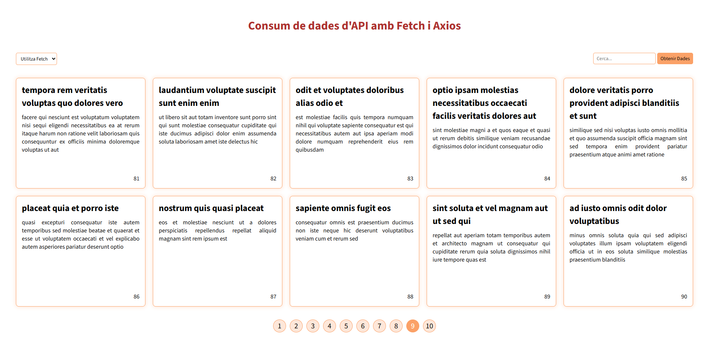
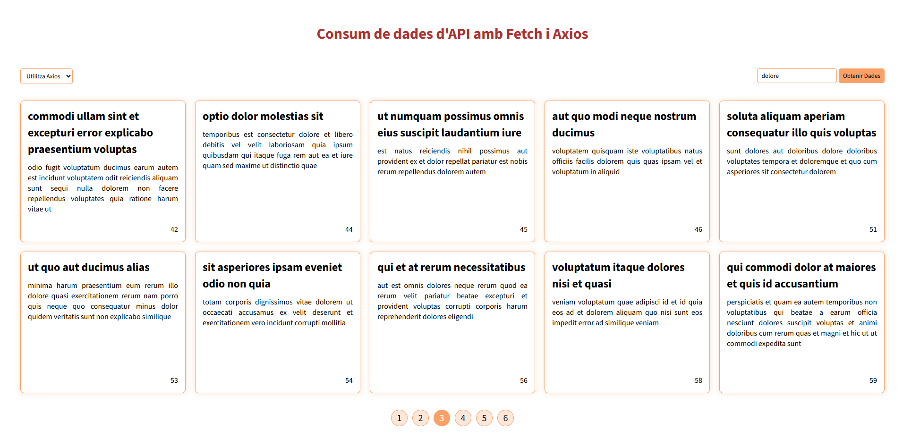

# API Consumer App

A vanilla JavaScript application that fetches and displays data from the [JSONPlaceholder](https://jsonplaceholder.typicode.com/) API, built as a learning exercise to compare Fetch API and Axios in a real project.

## Features

- Fetch data using either the native **Fetch API** or **Axios**
- Search posts by keyword
- Paginated results with active page state
- UI state management: loading spinner, error messages, empty state
- Responsive card grid layout

## Screenshots




## Tech Stack

- HTML5
- CSS3
- Vanilla JavaScript
- [Axios](https://axios-http.com/) via CDN
- [JSONPlaceholder](https://jsonplaceholder.typicode.com/) — fake REST API for testing

## Project Structure

```
api-consumer-app/
├── src/
│   ├── api-logic.js
│   ├── api-ui.js
│   └── assets/
│       ├── fonts/
│       │   ├── SourceSans3-VariableFont_wght.ttf
│       │   └── SourceSans3-Italic-VariableFont_wght.ttf
│       └── screenshots/
│           ├── screenshot-project.png
│           └── screenshot-search-axios.png
├── index.html
├── main.js
├── styles.css
└── .gitignore
```

## Getting Started

No build step required. Clone the repo and open `index.html` in your browser.

```bash
git clone https://github.com/Joel-Gandalf/api-consumer-app.git
cd api-consumer-app
```

Then open `index.html` directly in your browser, or use a local server:

```bash
npx serve .
```

## Usage

1. Select **Fetch** or **Axios** from the dropdown
2. Optionally type a search term in the input field
3. Click **Obtenir Dades** to load posts
4. Navigate between pages using the pagination buttons

## Author

**Joel Gandalf**
[GitHub](https://github.com/Joel-Gandalf)
